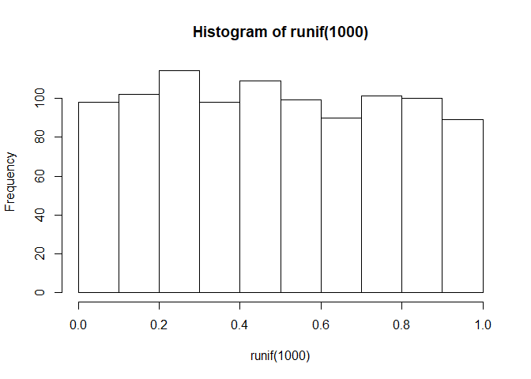
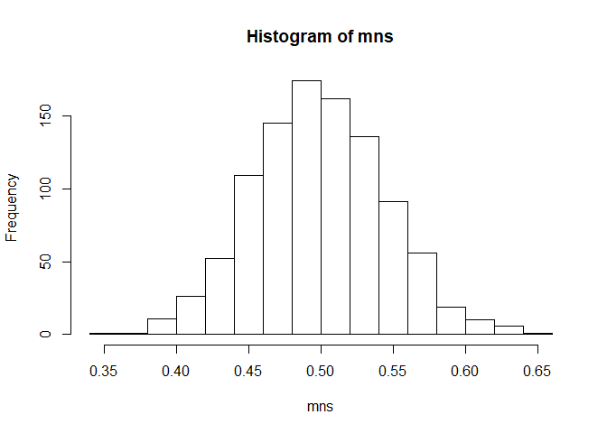
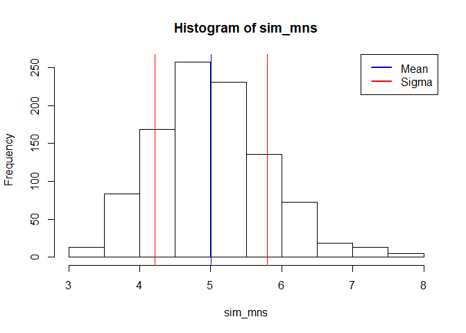

# Asymptotics and use of the Central Limit Theorem
Jack Welch  
June 4, 2017  

## Overview
Asymptotics is an important topic in statistics. Asymptotics refers to the behavior of estimators as the sample size goes to infinity. The very notion of probability depends on the idea of asymptotics. For example, many people define probability as the proportion of times an event would occur in infinite repetitions. That is, the probability of a head on a coin is 50% because we believe that if we were to flip the coin an infinite amount of times, we would get exactly 50% heads.

We can use asymptotics to help us figure things out about distributions without knowing much about them to begin with. A profound idea along these lines is the Central Limit Theorem. It states that the distribution of averages is often normal, even if the distribution that the data is being sampled from is very non-normal. This helps us create robust strategies for creating statistical inferences when we're not willing to assume much about the generating mechanism of our data.

## Introductory Example

As a motivating example, compare the distribution of 1000 random uniforms


```r
hist(runif(1000))
```

<!-- -->

and the distribution of 1000 averages of 40 random uniforms


```r
mns = NULL
for (i in 1 : 1000) mns = c(mns, mean(runif(40)))
hist(mns)
```

<!-- -->

This distribution looks far more Gaussian than the original uniform distribution!  This is a demonstration of the Central Limit Theorem in action.  The Central Limit Theorem is one of the most important methods used in statistical analysis.  The Central Limit Theorem states that the distribution of averages of iid variables (properly normalized) becomes that of a standard normal as the sample size increases.

The useful way to think about the CLT is to understand that the sample average is approximately normally distributed with a mean given by the population mean and a variance given by the standard error of the mean.

## Simulations

### Single Exponential Distribution

Let's simulate an exponential distribution and then visualize this exponential distribution with a histrogram, as given in the instructions for this project.


```r
# lambda and n are given variables
lambda = 0.2
n = 40

# simulate an exponential distribution and save it to a variable named 'expdist'
expdist <- rexp(n, lambda)

# output the content of the variable 'expdist' so that we can visualize the contents
expdist
```

```
##  [1]  5.01515505  0.09916302 11.05272087  4.71067335  9.75570307
##  [6]  3.53673085  1.78301440  2.90319836  5.61403375  2.78585876
## [11]  6.60500931  2.04071433  0.93071413  3.94142515 10.44152546
## [16]  3.16006572  0.84820849  1.61830614  0.59635023  1.88897376
## [21]  6.48026052  3.83229797  0.30346930 11.91281048  0.51537815
## [26]  3.08168118  2.22000126 21.20277199  0.76710296  6.57910278
## [31]  6.25017748  9.52221755  5.13629430  3.14050627  1.86681339
## [36]  0.89070648  7.68246488 11.35465484  1.35565919  2.35314488
```

```r
# create a histogram of the exponential distribution
hist(expdist)
# show the mean in the color blue on the histogram
abline(v = mean(expdist), col = "blue", lwd = 1)
# show the lower limit of sigma in the color red on the histogram
abline(v = mean(expdist)-sd(expdist), col = "red", lwd = 1)
# show the upper limit of sigma in the color red on the histogram
abline(v = mean(expdist)+sd(expdist), col = "red", lwd = 1)
# add a legend
legend(x = "topright", 
   c("Mean", "Sigma"),
   col = c("blue", "red"),
   lwd = c(2, 2))
```

<!-- -->

Now, let's calculate the mean of this simulated exponential distribution


```r
mean(expdist)
```

```
## [1] 4.644377
```

Now, let's calculate the standard deviation of this simulated exponential distribution


```r
sd(expdist)
```

```
## [1] 4.320884
```

### Theoretical Mean and Standard Deviation of Exponential Distribution

It is stated inside the exercise that the theoretical mean of the distribution is equal to 1/lambda.  It is further stated that the theoretical standard deviation is also equal to 1/lambda. Let's now calculate this theoretical mean and standard deviation.


```r
# calculate the theoretical mean and standard deviation
lambda^-1
```

```
## [1] 5
```

It is quite clear that the mean and standard deviation of our **single** simulated distribution is close to the theoretical calculation of 1/lambda.

### 1000 Samples of the Exponential Distribution

What happens if we now simulate 1000 exponential distributions and take the mean of these 1000 distributions?  The Central Limit Theorem tells us that the mean should get closer to the theoretical mean and the distribution of these means should become that of a standard normal, meaning that sigma should approach the value of 1.


```r
# simulate 1000 means of exponential distributions
sim_mns = NULL
for (i in 1 : 1000) sim_mns = c(sim_mns, mean(rexp(n, lambda)))

# generate a histogram
hist(sim_mns)

# show the mean in the color blue on the histogram
abline(v = mean(sim_mns), col = "blue", lwd = 1)
# show the lower limit of sigma in the color red on the histogram
abline(v = mean(sim_mns)-sd(sim_mns), col = "red", lwd = 1)
# show the upper limit of sigma in the color red on the histogram
abline(v = mean(sim_mns)+sd(sim_mns), col = "red", lwd = 1)
# add a legend
legend(x = "topright", 
   c("Mean", "Sigma"),
   col = c("blue", "red"),
   lwd = c(2, 2))
```

<!-- -->

Now let's calculate the mean of the means of these 1000 simulated distributions


```r
mean(sim_mns)
```

```
## [1] 5.035017
```

Now let's calculate the standard deviation of the means of these 1000 simulated distributions


```r
sd(sim_mns)
```

```
## [1] 0.7857929
```

## Conclusion

This series of simulations shows that we can start with a known distribution that is NOT normally distributed, in this case a logrithmic or exponential distribution, and if we take enough samples, calculate their means, and then chart these means with a histogram, then the distribution of these means will exhibit a mean which is equivalent to the population mean and a variance which becomes normal (sigma = 1).  This is precisely the definition of the Central Limit Theorem and this exercise has helped us simulate and to validate our understanding of this important statistical inference rule.

