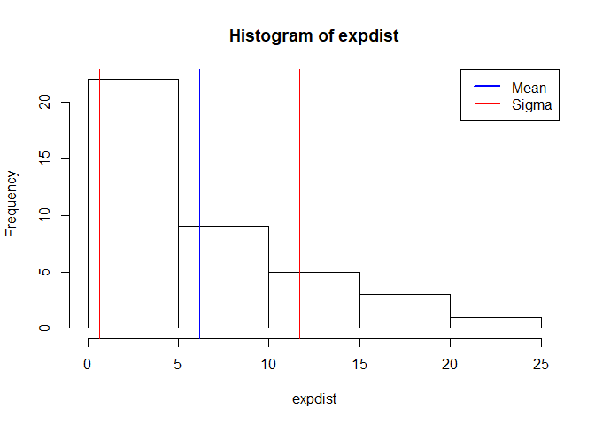

# Investigate the exponential distribution in R and compare it with the Central Limit Theorem
Jack Welch  
June 4, 2017  

## Overview
Asymptotics is an important topic in statistics. Asymptotics refers to the behavior of estimators as the sample size goes to infinity. The very notion of probability depends on the idea of asymptotics. For example, many people define probability as the proportion of times an event would occur in infinite repetitions. That is, the probability of a head on a coin is 50% because we believe that if we were to flip the coin an infinite amount of times, we would get exactly 50% heads.

We can use asymptotics to help us figure things out about distributions without knowing much about them to begin with. A profound idea along these lines is the Central Limit Theorem. It states that the distribution of averages is often normal, even if the distribution that the data is being sampled from is very non-normal. This helps us create robust strategies for creating statistical inferences when we're not willing to assume much about the generating mechanism of our data.

## Introductory Example

As a motivating example, compare the distribution of 1000 random uniforms


```r
hist(runif(1000))
```

<!-- -->

and the distribution of 1000 averages of 40 random uniforms


```r
mns = NULL
for (i in 1 : 1000) mns = c(mns, mean(runif(40)))
hist(mns)
```

<!-- -->

This distribution looks far more Gaussian than the original uniform distribution!  This is a demonstration of the Central Limit Theorem in action.  The Central Limit Theorem is one of the most important methods used in statistical analysis.  The Central Limit Theorem states that the distribution of averages of iid variables (properly normalized) becomes that of a standard normal as the sample size increases.

The useful way to think about the CLT is to understand that the sample average is approximately normally distributed with a mean given by the population mean and a variance given by the standard error of the mean.

## Simulation - Single Exponential Distribution

Let's simulate an exponential distribution and then visualize this exponential distribution with a histrogram, as given in the instructions for this project.


```r
# lambda and n are given variables
lambda = 0.2
n = 40

# simulate an exponential distribution and save it to a variable named 'expdist'
expdist <- rexp(n, lambda)

# output the content of the variable 'expdist' so that we can visualize the contents
expdist
```

```
##  [1]  0.275900508  1.570960467  2.965396363  2.168630261  2.550167721
##  [6] 16.769179738  4.192900071  4.731846517  0.004768543  3.199989051
## [11]  6.840757821  3.256670034  3.004822250  2.231998092  4.662691927
## [16]  5.247346354  5.812189877  3.381160139 18.079725531  6.084014918
## [21]  3.759809281 11.499128928  6.228080095  1.082625429  1.964145249
## [26] 16.042695715 10.861935159  6.360792820 13.082329844  0.557937025
## [31]  1.154277492 17.830466174  3.157988917  8.848415315  5.290896963
## [36]  3.457721178  2.557441257  3.477391288  4.941240568  1.821908004
```

```r
# create a histogram of the exponential distribution
hist(expdist)
```

<!-- -->

Now, let's calculate the mean of this simulated exponential distribution


```r
mean(expdist)
```

```
## [1] 5.525209
```

Now, let's calculate the standard deviation of this simulated exponential distribution


```r
sd(expdist)
```

```
## [1] 4.893565
```

## Simulation - Theoretical Mean and Standard Deviation

It is stated inside the exercise that the theoretical mean of the distribution is equal to 1/lambda.  It is further stated that the theoretical standard deviation is also equal to 1/lambda. Let's now calculate this theoretical mean and standard deviation.


```r
# calculate the theoretical mean and standard deviation
lambda^-1
```

```
## [1] 5
```

## Simulation - 1000 Samples of the Exponential Distribution

It is quite clear that the mean and standard deviation of our **single** simulated distribution is close to the theoretical mean and this is only one **single** distribution.  What happens if we now simulate 1000 exponential distributions and take the mean of these 1000 distributions?  The Central Limit Theorem tells us that the mean should get closer to the theoretical mean and the distribution of these means should become that of a standard normal.


```r
sim_mns = NULL
for (i in 1 : 1000) sim_mns = c(sim_mns, mean(rexp(n, lambda)))

hist(sim_mns)
```

<!-- -->

Now let's calculate the mean of the means of these 1000 simulated distributions


```r
mean(sim_mns)
```

```
## [1] 5.025306
```

Now let's calculate the standard deviation of the means of these 1000 simulated distributions


```r
sd(sim_mns)
```

```
## [1] 0.79456
```
