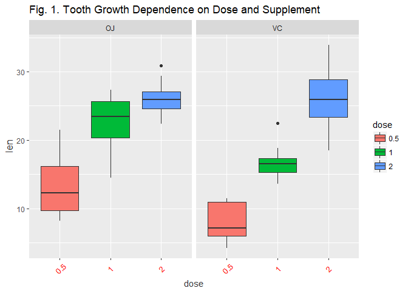

# Exploratory Data Analysis of Tooth Growth
Jack Welch  
June 6, 2017  

## Overview

Instructions taken from the Statistical Inference course offered by Johns Hopkins University on Coursera:

In the second portion of the project, we're going to analyze the ToothGrowth data in the R datasets package.  This dataset contains observations related to the length of odontoblasts (cell response for tooth growth) in guinea pigs.  We are to analyze the growth corresponding to a specific dose of Vitamin C delivered in 3 possible doses (0.5, 1.0 and 2.0 mg/day) and delivered via two possible different supplement types (OJ=Orange juice or VC=Ascorbic Acid).

1. Load the ToothGrowth data and perform some basic exploratory data analyses
2. Provide a basic summary of the data.
3. Use confidence intervals and/or hypothesis tests to compare tooth growth by supp and dose. (Only use the techniques from class, even if there's other approaches worth considering)
4. State your conclusions and the assumptions needed for your conclusions.

## Exploratory Data Analysis of the ToothGrowth Dataset

We have not been given any instructions whatsoever related to the format of this data set or what it might represent.  We have been asked to attempt to familiarize ourselves with this data with the use of exploratory data analysis techniques available with R programming.  We will now conduct a few techniques so that we can become more familiar with this dataset.  Comments are embedded within the R code below.


```r
# Load ToothGrowth dataset
tgdata <- ToothGrowth

# output a summary of the dataset
summary(tgdata)
```

```
##       len        supp         dose      
##  Min.   : 4.20   OJ:30   Min.   :0.500  
##  1st Qu.:13.07   VC:30   1st Qu.:0.500  
##  Median :19.25           Median :1.000  
##  Mean   :18.81           Mean   :1.167  
##  3rd Qu.:25.27           3rd Qu.:2.000  
##  Max.   :33.90           Max.   :2.000
```

```r
# identify the structure of the existing dataset
str(tgdata)
```

```
## 'data.frame':	60 obs. of  3 variables:
##  $ len : num  4.2 11.5 7.3 5.8 6.4 10 11.2 11.2 5.2 7 ...
##  $ supp: Factor w/ 2 levels "OJ","VC": 2 2 2 2 2 2 2 2 2 2 ...
##  $ dose: num  0.5 0.5 0.5 0.5 0.5 0.5 0.5 0.5 0.5 0.5 ...
```

```r
# convert dose to a factor and look at structural change
tgdata$dose <- factor(tgdata$dose)
str(tgdata)
```

```
## 'data.frame':	60 obs. of  3 variables:
##  $ len : num  4.2 11.5 7.3 5.8 6.4 10 11.2 11.2 5.2 7 ...
##  $ supp: Factor w/ 2 levels "OJ","VC": 2 2 2 2 2 2 2 2 2 2 ...
##  $ dose: Factor w/ 3 levels "0.5","1","2": 1 1 1 1 1 1 1 1 1 1 ...
```

```r
# visualize the dataset (since it is a small dataset)
tgdata
```

```
##     len supp dose
## 1   4.2   VC  0.5
## 2  11.5   VC  0.5
## 3   7.3   VC  0.5
## 4   5.8   VC  0.5
## 5   6.4   VC  0.5
## 6  10.0   VC  0.5
## 7  11.2   VC  0.5
## 8  11.2   VC  0.5
## 9   5.2   VC  0.5
## 10  7.0   VC  0.5
## 11 16.5   VC    1
## 12 16.5   VC    1
## 13 15.2   VC    1
## 14 17.3   VC    1
## 15 22.5   VC    1
## 16 17.3   VC    1
## 17 13.6   VC    1
## 18 14.5   VC    1
## 19 18.8   VC    1
## 20 15.5   VC    1
## 21 23.6   VC    2
## 22 18.5   VC    2
## 23 33.9   VC    2
## 24 25.5   VC    2
## 25 26.4   VC    2
## 26 32.5   VC    2
## 27 26.7   VC    2
## 28 21.5   VC    2
## 29 23.3   VC    2
## 30 29.5   VC    2
## 31 15.2   OJ  0.5
## 32 21.5   OJ  0.5
## 33 17.6   OJ  0.5
## 34  9.7   OJ  0.5
## 35 14.5   OJ  0.5
## 36 10.0   OJ  0.5
## 37  8.2   OJ  0.5
## 38  9.4   OJ  0.5
## 39 16.5   OJ  0.5
## 40  9.7   OJ  0.5
## 41 19.7   OJ    1
## 42 23.3   OJ    1
## 43 23.6   OJ    1
## 44 26.4   OJ    1
## 45 20.0   OJ    1
## 46 25.2   OJ    1
## 47 25.8   OJ    1
## 48 21.2   OJ    1
## 49 14.5   OJ    1
## 50 27.3   OJ    1
## 51 25.5   OJ    2
## 52 26.4   OJ    2
## 53 22.4   OJ    2
## 54 24.5   OJ    2
## 55 24.8   OJ    2
## 56 30.9   OJ    2
## 57 26.4   OJ    2
## 58 27.3   OJ    2
## 59 29.4   OJ    2
## 60 23.0   OJ    2
```

Let's now load the **ggplot2** library and visualize this data on a box plot.


```r
library("ggplot2")
tgdata$dose=as.factor(tgdata$dose)
ggplot(tgdata, aes(x=dose,y=len)) + 
    geom_boxplot(aes(fill = dose)) + 
    ggtitle('Fig.1. Tooth Growth Dependence on Dose and Supplement ') + 
    facet_grid(.~supp) + 
        theme(axis.title.y = element_text(colour="gray20",size=12,angle=90,hjust=.5,vjust=1),
        axis.title.x = element_text(colour="gray20"),
        plot.title = element_text(vjust=1.5,size = 12,colour="purple"),
        axis.text.x = element_text(colour="red",size=10,angle=45,hjust=.5, vjust=.5))
```

<!-- -->

The box plots, as shown above in Fig. 1, allow us to visualize the distribution of the data along with five other important data points, including the min value, max value, mean, and the 1st and 3rd quartiles.  Points on the lines outside the boxes are considered the outliers in the dataset.  This visualization of the distribution of data clearly suggests that tooth growth in the guinea pigs clearly favored the delivery of the Vitamin C via the OJ with the smaller doses of 0.5 and 1 mg/day. The data further shows that while the means of the tooth growth related to the method of supplement delivery are equivalent with the higher dose of 2 mg/day. The tooth growth does show slightly higher normal variation with the ascorbic acid supplement in that higher dose of 2 mg/day.


